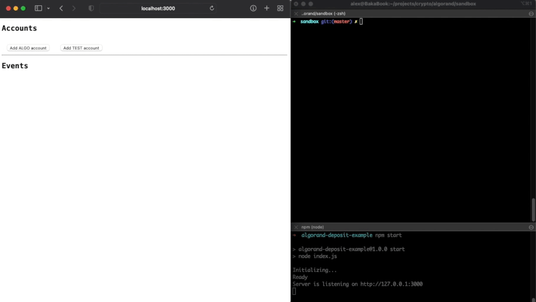

# Algorand Deposit Example

Example of managing deposit accounts for Algorand.

### Features

- Creating accounts for Algo deposits
- Creating accounts for Algorand Standard Assets (ASA) deposits
- Watching account balances and emitting events once they get new deposits

A fictional `TEST` asset is created automatically in the Sandbox and is used as an example for ASA transactions.



## Requirements

[Algorand Sandbox](https://github.com/algorand/sandbox#readme) must be up and running in the _Private network_ mode (default one) prior to starting this app.
Please refer to the Sandbox documentation to find the most relevant information on how to download and start it.

For the best experience it is recommended to reset the Sandbox to its initial state by running the following command in the Sandbox directory:

```bash
./sandbox reset
```

### Sandbox default account usage

For demonstration purposes, two of the default Sandbox accounts are used in the following fashion:

- First account: _hot wallet_, used to make plumbing top-ups necessary for ASA
- Second account: _external account_, used to simulate external top up our deposit accounts

## Getting started

Clone this repository and install dependencies:

```bash
npm install
```

Start the app and wait until it gets ready:

```bash
npm start
```

The app is available on http://localhost:3000

## Author

Alex Bakoushin

## License

MIT
